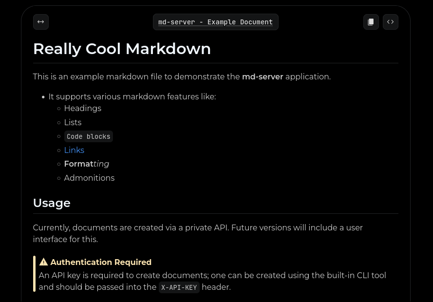

# md-server

A tiny markdown preview server for your services.

## Features

- Serves markdown previews styled with heavily modified GitHub-flavored markdown.
- Dedicated admonition support. (`!!! note`, `!!! warning`, etc.)
- Renders markdown to HTML using `markdown-it-py` with plugins for tables, task lists
- Uploads and manages files using a RESTful API, designed for integration with other services. (API key required)
- MongoDB backend for file storage, metadata, and API keys.
- Configuration via environment variables or `.env` file.
- Integrated CLI for API key management and server control.
- Comprehensive logging with configurable levels and file rotation.

### Notablably Missing Features

- [ ] DB support for SQL databases
- [ ] Complete markdown support (e.g., math, diagrams)
- [ ] Currently, the markdown styling is a bit messy
- [ ] A favicon (somehow)
- [ ] Easy CLI access within a Docker container

## Screenshots

### A sample document



## Installation

### Docker Setup

Create a container using `ghcr.io/squid1127/md-server:main` image. No volumes are required, but environment variables are necessary to connect to MongoDB.

CLI Access:

```bash
docker exec -it <container_id> python cli.py

# Create an API key
docker exec -it <container_id> python cli.py auth new "My Key"
```

> [!NOTE]
> This may change in the future to a more user-friendly method.

## Local Setup

To install and run locally, ensure you have Python 3.13+ and Poetry installed. Then:

```bash
git clone https://github.com/squid1127/md-server.git # Clone the repository
cd md-server # Change to the project directory
poetry install # Install dependencies
poetry run md-server # Run the server
```

### Usage Example

(Assuming local setup; MongoDB must be running and accessible)

```bash
# Set log level to DEBUG for development
export LOG_LEVEL=DEBUG
export MONGO_URI="mongodb://localhost:27017" # Set your MongoDB URI
poetry run md-server run

# Or set in .env file
echo "LOG_LEVEL=DEBUG" >> .env
```

Refer to [environment variables](docs/env.md) for configuration options.

### API Usage

Refer to [API documentation](docs/api.md)
